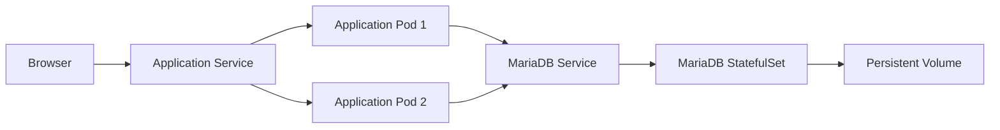

# Web Course Dashboard

Курсов проект за автоматизиран software delivery процес. Приложението е
табло за университетски курс с две роли — студент и преподавател.

Repository: https://github.com/nyotova19/web-course-dashboard

## Приложение

Проектът включва:

- PHP 8.3 REST API;
- MariaDB 11;
- HTML, CSS и JavaScript интерфейс;
- JWT authentication;
- роли за студент и преподавател;
- управление на теми, реферати, домашни работи и презентации.

Локалната среда се стартира с Docker Compose, а Kubernetes вариантът използва
две application реплики и отделен MariaDB StatefulSet.

## Архитектура



Application image-ът съдържа Nginx, PHP-FPM, REST API и frontend файловете.

## Покритие на темите от курса

В проекта са приложени следните теми от курса:

| Тема от условието | Реализация в проекта |
|---|---|
| Phases of SDLC | Issue, feature branch, проверка, Pull Request и release |
| Collaborate | GitHub Issues и Pull Requests |
| Source control | Git и GitHub |
| Branching strategies | `main`, `develop`, `feature/*` и `fix/*` |
| Building Pipelines | GitHub Actions workflow |
| Continuous Integration | validation, PHPUnit, Composer Audit и Semgrep |
| Continuous Delivery | Docker build, Trivy scan и deployment в Kind |
| Security | JWT, prepared statements, Composer Audit, Semgrep и Trivy |
| Docker | Dockerfile и Docker Compose |
| Kubernetes | Deployment, StatefulSet, Services, probes и rolling update |
| Infrastructure as code | workflow, Compose, Kubernetes YAML и Kustomize |
| Database changes | versioned SQL schema и seed файлове |


## Software delivery процес

```text
Issue
  -> feature branch
  -> local check
  -> push
  -> Continuous Integration
  -> PHPUnit and security checks
  -> Docker image build
  -> Trivy scan
  -> Deploy to Kubernetes
  -> smoke test
  -> Pull Request
```

Workflow файлът е:

```text
.github/workflows/ci.yml
```

Pipeline-ът се стартира при push към `main`, `develop`, `feature/**` и
`fix/**`, както и при Pull Request към `main` или `develop`.

## Continuous Integration

| Job | Проверки |
|---|---|
| Validate and scan PHP | Composer validation, PHP syntax, Composer Audit и Docker Compose validation |
| Run unit tests | PHPUnit |
| SAST with Semgrep | Статичен анализ на PHP кода |
| Build and scan Docker image | Docker build и Trivy scan |
| Deploy to Kubernetes test cluster | Kind, Kustomize, rollout и health smoke test |

Следващ job се изпълнява само ако зависимите от него проверки са успешни.

## Branching strategies

- `main` — версията за предаване;
- `develop` — интеграционен branch;
- `feature/*` — нова функционалност;
- `fix/*` — поправка.

Промените се правят във feature branch и се сливат чрез Pull Request след
успешен pipeline.

## Стартиране с Docker Compose

Необходими са Docker Desktop и Docker Compose v2.

```powershell
Copy-Item .env.example .env
docker compose up -d --build
docker compose ps
```

Преди стартиране промени `JWT_SECRET` в локалния `.env`.

Адреси:

| URL | Предназначение |
|---|---|
| http://localhost:8080 | Приложение |
| http://localhost:8080/api/health | API health check |
| `localhost:3306` | MariaDB |

Спиране:

```powershell
docker compose down
```

## Автоматизирани тестове

```powershell
docker compose exec php composer test
docker compose exec php composer audit
```

Текущият тестов пакет съдържа 4 теста и 10 assertions.

## Стартиране в Kubernetes

Необходими са Docker Desktop, активиран Kubernetes и `kubectl`.

```powershell
docker build -t web-course-dashboard:k8s ./backend
Copy-Item k8s\secret.example.yaml k8s\secret.yaml
```

Замени стойностите `CHANGE_ME` в `k8s/secret.yaml`. Файлът е в `.gitignore`
и не трябва да се добавя в repository-то.

```powershell
kubectl apply -f k8s\namespace.yaml
kubectl apply -f k8s\secret.yaml
kubectl apply -k .

kubectl -n web-course rollout status statefulset/mariadb
kubectl -n web-course rollout status deployment/web-course-dashboard
kubectl -n web-course get pods,service,pvc
```

Достъп до приложението:

```powershell
kubectl -n web-course port-forward service/web-course-dashboard 8081:80
```

Отвори:

```text
http://localhost:8081
```

## Scaling и rolling update

Deployment-ът декларира две application реплики.

```powershell
kubectl -n web-course scale deployment/web-course-dashboard --replicas=3
kubectl -n web-course get pods
kubectl -n web-course scale deployment/web-course-dashboard --replicas=2
```

Rolling update настройката е:

```yaml
maxUnavailable: 0
maxSurge: 1
```

Rollback:

```powershell
kubectl -n web-course rollout undo deployment/web-course-dashboard
```

## Тестови акаунти

| Email | Парола | Роля |
|---|---|---|
| `student@uni.bg` | `student123` | Студент |
| `teacher@uni.bg` | `teacher123` | Преподавател |

## Документация

- [API reference](docs/API.md)
- [DevOps процес и SAST deep dive](docs/DEVOPS.md)