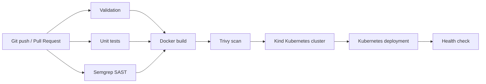

# Web Course Dashboard

Финален DevOps проект за автоматизиран software delivery процес — от промяна
в Git до проверен deployment в Kubernetes.

GitHub repository:

```text
https://github.com/nyotova19/web-course-dashboard
```

Приложението е система за управление на университетски курс. Използва PHP
8.3, MariaDB и JavaScript. Основната част на проекта е автоматизирането на
проверките, изграждането и deployment-а.

## Цел на проекта

Процесът започва от Git repository и преминава през:

```text
Git
→ validation
→ unit tests
→ SAST
→ Docker build
→ vulnerability scan
→ Kubernetes deployment
→ health check
```

## Използвани теми

В проекта са приложени следните теми от курса:

| Тема | Реализация |
|---|---|
| Phases of SDLC | Issue, feature branch, проверка, Pull Request и merge |
| Collaborate | GitHub Issues и Pull Requests |
| Source control | Git и GitHub |
| Branching strategies | `main`, `develop`, `feature/*` и `fix/*` |
| Building Pipelines | GitHub Actions workflow |
| Continuous Integration | Validation, PHPUnit и Semgrep |
| Continuous Delivery | Docker build и deployment в Kubernetes |
| Security | Composer Audit, Semgrep, Trivy, JWT и Secrets |
| Docker | Dockerfile и Docker Compose |
| Kubernetes | Deployment, StatefulSet, Services, probes и scaling |
| Infrastructure as code | Workflow, Docker и Kubernetes конфигурация |
| Database changes | SQL schema и seed файлове |

## T-shaped решение

Решението е T-shaped.

Хоризонталната част обхваща целия DevOps процес:

```text
Source control
→ CI
→ Tests
→ Security
→ Docker
→ Kubernetes
```

Вертикалната тема е SAST анализът със Semgrep. При него автоматична проверка
откри проблем в SQL заявка, pipeline-ът беше спрян, кодът беше поправен и
проверката беше изпълнена отново.

## Source control и Branching strategies

Source кодът се съхранява в GitHub.

Използваните branches са:

- `main` — завършена версия;
- `develop` — интеграция на промените;
- `feature/*` — разработване на отделни задачи;
- `fix/*` — поправки.

Работният процес е:

```text
Issue
→ feature branch
→ local check
→ push
→ GitHub Actions
→ Pull Request
→ merge
```

За отделните части на проекта са използвани feature branches за:

- GitHub Actions;
- автоматизирани тестове;
- security scanning;
- Kubernetes deployment;
- документация.

Pull Requests показват променения код и резултата от автоматичните проверки.

## GitHub Actions pipeline

Pipeline конфигурацията е във:

```text
.github/workflows/ci.yml
```

Workflow-ът се стартира при push, Pull Request и ръчно чрез
`workflow_dispatch`.



Docker build започва само ако validation, unit tests и Semgrep са успешни.
Kubernetes deployment започва само след успешен Docker build и Trivy scan.

## Continuous Integration

### Validate and scan PHP

Job-ът изпълнява:

```text
composer validate
composer install
php -l
composer audit
docker compose config --quiet
```

Проверяват се:

- Composer конфигурацията;
- PHP синтаксисът;
- PHP dependencies;
- Docker Compose конфигурацията.

### Run unit tests

PHPUnit изпълнява тестовете от:

```text
backend/tests/RouterTest.php
backend/tests/JwtTest.php
```

Тестовете проверяват Router и JWT логиката.

Текущ резултат:

```text
4 tests, 10 assertions
```

### SAST with Semgrep

Semgrep проверява PHP source кода:

```text
backend/src
backend/public
```

Командата в pipeline-а е:

```text
semgrep scan --config auto --error backend/src backend/public
```

Опцията `--error` спира pipeline-а при security finding.

## Security deep dive

При първото изпълнение Semgrep откри проблем в pagination заявката в
`ReportsController.php`.

Стойностите за `LIMIT` и `OFFSET` участваха в създаването на SQL текста.
Заявката беше променена да използва placeholders:

```sql
LIMIT ? OFFSET ?
```

Стойностите се подават отделно като цели числа:

```php
$stmt->bindValue($position, $value, PDO::PARAM_INT);
```

Така query параметрите не се добавят директно в SQL текста.

Semgrep отчете и `tainted-callable` finding върху PDO `prepare()`. След
проверка на data flow-а находката беше определена като false positive. За нея
е добавено изключение само за конкретното правило.

Semgrep остава активен за останалия код и продължава да бъде blocking проверка
в pipeline-а.

## Dependency и container scanning

Composer Audit проверява PHP dependencies за известни уязвимости.

При разработката беше открит advisory за използвана версия на
`firebase/php-jwt`. Dependency-то беше обновено и актуалната версия беше
записана в `composer.lock`.

След Docker build Trivy проверява application image-а:

```text
vulnerability types: os, library
severity: HIGH, CRITICAL
exit code: 1
```

При такава находка Kubernetes deployment не започва.

## Docker

За локалната среда се използва Docker Compose.

Стартират се:

- Nginx;
- PHP-FPM;
- MariaDB.

`backend/Dockerfile` създава application image с:

- PHP 8.3;
- PHP-FPM;
- Nginx;
- Supervisor;
- REST API;
- frontend файлове;
- Composer dependencies.

Същият image се използва от Kubernetes Deployment.

## Continuous Delivery и Kubernetes

След успешния Trivy scan GitHub Actions:

1. създава Kind Kubernetes cluster;
2. изгражда application image;
3. зарежда image-а в cluster-а;
4. валидира Kustomize конфигурацията;
5. генерира временни Secrets;
6. прилага Kubernetes ресурсите;
7. изчаква MariaDB и приложението;
8. проверява `/api/health`.

Kubernetes конфигурацията включва:

- namespace `web-course`;
- ConfigMap;
- Secret;
- MariaDB StatefulSet;
- PersistentVolumeClaim;
- application Deployment;
- Services;
- startup, readiness и liveness probes;
- resource requests и limits.

Application Deployment използва две реплики:

```yaml
replicas: 2
```

Rolling update стратегията е:

```yaml
maxUnavailable: 0
maxSurge: 1
```

Kubernetes стартира нов pod и изчаква той да бъде готов, преди да спре стария.

## Infrastructure as code

Конфигурацията е част от Git repository-то:

| Файл | Предназначение |
|---|---|
| `.github/workflows/ci.yml` | GitHub Actions pipeline |
| `backend/Dockerfile` | Application image |
| `docker-compose.yml` | Локална среда |
| `k8s/*.yaml` | Kubernetes ресурси |
| `kustomization.yaml` | Общо Kubernetes описание |
| `mariadb-init/*.sql` | Database структура и начални данни |

Средата се създава чрез versioned файловете в repository-то.

## Database changes

Database структурата и началните данни са разделени в:

```text
mariadb-init/01-schema.sql
mariadb-init/02-seed.sql
```

`01-schema.sql` създава таблиците. `02-seed.sql` добавя тестовите данни.

Файловете се изпълняват в този ред при първоначалното стартиране на MariaDB.

## Стартиране с Docker Compose

```powershell
Copy-Item .env.example .env
docker compose up -d --build
docker compose ps
```

Приложението е достъпно на:

```text
http://localhost:8080
```

Спиране:

```powershell
docker compose down
```

## Стартиране в Kubernetes

Провери Docker Desktop и Kubernetes:

```powershell
docker info
kubectl get nodes
```

Изгради application image:

```powershell
docker build -t web-course-dashboard:k8s ./backend
```

Приложи конфигурацията:

```powershell
kubectl apply -f k8s\namespace.yaml
kubectl apply -f k8s\secret.yaml
kubectl apply -k .
```

Изчакай rollout:

```powershell
kubectl -n web-course rollout status statefulset/mariadb
kubectl -n web-course rollout status deployment/web-course-dashboard
```

Отвори достъп до приложението:

```powershell
kubectl -n web-course port-forward service/web-course-dashboard 8081:80
```

Адрес:

```text
http://localhost:8081
```

## Live demo

Показване на ресурсите:

```powershell
kubectl -n web-course get pods,service,pvc
```

Rolling restart:

```powershell
kubectl -n web-course rollout restart deployment/web-course-dashboard
kubectl -n web-course rollout status deployment/web-course-dashboard
kubectl -n web-course get pods
```

По време на rolling restart приложението остава достъпно през Kubernetes Service.

## Документация

- [API](docs/API.md)
- [DevOps процес](docs/DEVOPS.md)
