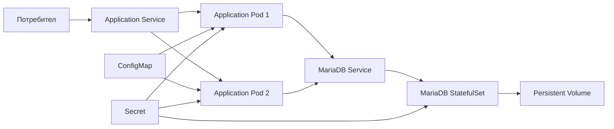
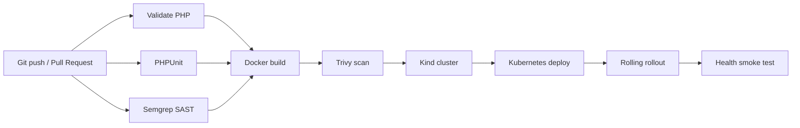

# Web Course Dashboard

Web приложение за управление на университетски курс с роли за студенти и
преподаватели. Проектът демонстрира цялостен автоматизиран DevOps процес:
тестване, security scanning, изграждане на Docker image и deployment в
Kubernetes.

## Технологии

- PHP 8.3 и custom REST API
- MariaDB 11 и PDO prepared statements
- HTML, CSS и JavaScript SPA
- JWT authentication
- Nginx и PHP-FPM
- PHPUnit
- Docker и Docker Compose
- GitHub Actions
- Semgrep SAST
- Trivy container scanning
- Kubernetes, Kind и Kustomize

## Архитектура



Всеки application container съдържа:

- Nginx;
- PHP-FPM;
- PHP REST API;
- frontend файловете.

MariaDB работи като StatefulSet с persistent storage.

## CI/CD pipeline

Pipeline-ът се намира в `.github/workflows/ci.yml`.



| Етап | Предназначение |
|------|----------------|
| Composer validation | Проверява PHP dependency конфигурацията |
| PHP syntax check | Открива синтактични грешки |
| Composer audit | Проверява dependencies за известни уязвимости |
| PHPUnit | Изпълнява автоматизираните unit тестове |
| Semgrep | Извършва SAST анализ на PHP кода |
| Docker build | Създава application image |
| Trivy | Блокира HIGH и CRITICAL container уязвимости |
| Kind deployment | Deploy-ва приложението във временен Kubernetes cluster |
| Smoke test | Проверява `/api/health` след deployment |

## Branching стратегия

- `main` — стабилна версия;
- `develop` — интеграционен клон;
- `feature/*` — разработка на нови функционалности;
- `fix/*` — поправки.

Промените се разработват във feature branch и се добавят в `develop` чрез
Pull Request след успешен pipeline.

## Стартиране с Docker Compose

### Изисквания

- Docker Desktop;
- Docker Compose v2;
- свободни портове `8080` и `3306`.

### Конфигурация

```powershell
Copy-Item .env.example .env
```

Промени поне `JWT_SECRET` в `.env` с дълга случайна стойност.

### Стартиране

```powershell
docker compose up -d --build
docker compose ps
```

| URL | Описание |
|-----|----------|
| http://localhost:8080 | Web Course Dashboard |
| http://localhost:8080/api/health | REST API health endpoint |
| `localhost:3306` | MariaDB |

Спиране:

```powershell
docker compose down
```

## Тестови акаунти

| Email | Парола | Роля |
|-------|--------|------|
| `student@uni.bg` | `student123` | Студент |
| `teacher@uni.bg` | `teacher123` | Преподавател |

Тестовите данни се зареждат от `mariadb-init/02-seed.sql` при първото
стартиране върху празен database volume.

## Автоматизирани тестове

```powershell
docker compose exec php composer test
docker compose exec php composer audit
```

Очакван резултат:

```text
OK (4 tests, 10 assertions)
No security vulnerability advisories found.
```

## Локално стартиране в Kubernetes

### Изисквания

- Docker Desktop;
- активиран Kubernetes;
- `kubectl`.

Изгради application image:

```powershell
docker build -t web-course-dashboard:k8s ./backend
```

Създай локален Secret:

```powershell
Copy-Item k8s\secret.example.yaml k8s\secret.yaml
```

Замени всички `CHANGE_ME` стойности в `k8s/secret.yaml`. Реалният файл е
включен в `.gitignore` и не трябва да се commit-ва.

Deploy:

```powershell
kubectl apply -f k8s\namespace.yaml
kubectl apply -f k8s\secret.yaml
kubectl apply -k .

kubectl -n web-course rollout status statefulset/mariadb
kubectl -n web-course rollout status deployment/web-course-dashboard
kubectl -n web-course get pods,service,pvc
```

Достъп:

```powershell
kubectl -n web-course port-forward service/web-course-dashboard 8081:80
```

| URL | Описание |
|-----|----------|
| http://localhost:8081 | Kubernetes deployment |
| http://localhost:8081/api/health | Kubernetes health endpoint |

## Horizontal scaling

Deployment manifest-ът декларира две application реплики.

Временно мащабиране до три:

```powershell
kubectl -n web-course scale deployment/web-course-dashboard --replicas=3
kubectl -n web-course rollout status deployment/web-course-dashboard
kubectl -n web-course get pods
```

Връщане до две:

```powershell
kubectl -n web-course scale deployment/web-course-dashboard --replicas=2
```

## Rolling update и rollback

```powershell
kubectl -n web-course rollout status deployment/web-course-dashboard
kubectl -n web-course rollout history deployment/web-course-dashboard
kubectl -n web-course rollout undo deployment/web-course-dashboard
```

## Структура на проекта

```text
web-course-dashboard/
├── .github/workflows/ci.yml     # GitHub Actions pipeline
├── backend/                     # PHP API, Dockerfile и PHPUnit тестове
├── frontend/                    # HTML, CSS и JavaScript SPA
├── docker/                      # Nginx конфигурация за Docker Compose
├── k8s/                         # Kubernetes manifests
├── mariadb-init/                # Database schema и seed данни
├── docs/                        # Подробна проектна документация
├── docker-compose.yml
├── kustomization.yaml
└── README.md
```

## Сигурност

- bcrypt password hashing;
- JWT authentication;
- role-based authorization;
- PDO prepared statements;
- Composer dependency audit;
- Semgrep SAST;
- Trivy Docker image scanning;
- Kubernetes Secrets;
- readiness, liveness и startup probes;
- container resource requests и limits;
- `.env` и `k8s/secret.yaml` са изключени от Git.

## Покрити DevOps теми

Проектът покрива повече от изискваните седем теми:

1. Software Development Lifecycle;
2. source control;
3. branching strategies;
4. build pipelines;
5. Continuous Integration;
6. Continuous Delivery;
7. automated testing;
8. security scanning;
9. Docker;
10. Kubernetes;
11. Infrastructure as Code;
12. databases и persistent storage.

## Допълнителна документация

- [API документация](docs/API.md)
- [DevOps архитектура и pipeline](docs/DEVOPS.md)
