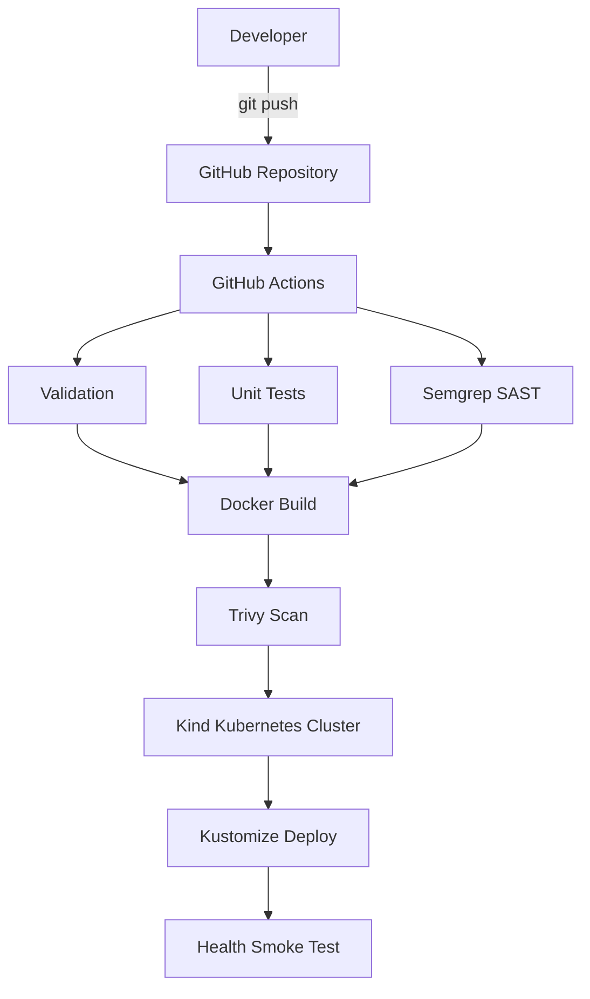
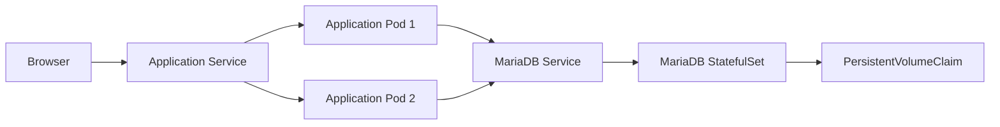

# DevOps архитектура и автоматизиран delivery процес

## 1. Цел

Целта на проекта е да реализира цялостен автоматизиран software delivery
процес — от промяна в source кода до проверен deployment в Kubernetes.

Процесът обхваща:

1. source control;
2. branching strategy;
3. automated testing;
4. Continuous Integration;
5. security scanning;
6. Docker image build;
7. container vulnerability scanning;
8. Infrastructure as Code;
9. Kubernetes deployment;
10. rolling updates;
11. persistent database storage;
12. health smoke testing.

## 2. High-level архитектура



Pipeline-ът блокира следващите етапи при неуспешен задължителен job.

## 3. Application архитектура

Application image-ът съдържа:

- Nginx на порт 80;
- PHP-FPM;
- custom PHP REST API;
- Composer production dependencies;
- frontend static файловете.

Това позволява една application реплика да бъде самостоятелна и да се
мащабира хоризонтално без споделена filesystem директория.



## 4. Source control и branching

Използван е GitHub repository със следните клонове:

| Branch | Предназначение |
|--------|----------------|
| `main` | Стабилна версия |
| `develop` | Интеграционна версия |
| `feature/*` | Разработка на нова функционалност |
| `fix/*` | Поправка на дефект |

Работният процес е:

```text
Issue
  ↓
feature branch
  ↓
local validation
  ↓
push
  ↓
GitHub Actions
  ↓
Pull Request към develop
  ↓
review и merge
```

Feature branches, използвани при разработката:

- `feature/devops-setup`;
- `feature/github-actions`;
- `feature/automated-tests`;
- `feature/security-scanning`;
- `feature/kubernetes-deployment`;
- `feature/documentation`.

## 5. Continuous Integration

Workflow файл:

```text
.github/workflows/ci.yml
```

Pipeline-ът се изпълнява при:

- push към `main`;
- push към `develop`;
- push към `feature/**`;
- push към `fix/**`;
- Pull Request към `main` или `develop`;
- ръчно стартиране чрез `workflow_dispatch`.

### 5.1 Validate and scan PHP

Изпълнява:

```text
composer validate
composer install
php -l
composer audit
docker compose config
```

Причини:

- проверява `composer.json` и `composer.lock`;
- открива PHP syntax грешки;
- открива известни dependency уязвимости;
- валидира Docker Compose конфигурацията.

### 5.2 Run unit tests

Изпълнява PHPUnit тестовете:

```text
backend/tests/RouterTest.php
backend/tests/JwtTest.php
```

Текущ резултат:

```text
4 tests
10 assertions
```

### 5.3 SAST with Semgrep

Semgrep анализира:

```text
backend/src
backend/public
```

Използва автоматично избрани PHP security правила и връща неуспешен exit code
при blocking finding.

### 5.4 Build and scan Docker image

След успешни validation, tests и SAST:

1. изгражда application Docker image;
2. стартира Trivy;
3. проверява OS и library vulnerabilities;
4. блокира pipeline-а при fixable `HIGH` или `CRITICAL` проблем.

### 5.5 Deploy to Kubernetes test cluster

След успешен build и Trivy scan:

1. създава временен Kind cluster;
2. изгражда application image;
3. зарежда image-а в Kind;
4. валидира Kustomize manifests;
5. генерира временни случайни secrets;
6. deploy-ва MariaDB и приложението;
7. изчаква StatefulSet и Deployment rollout;
8. изпълнява health smoke test.

Kind cluster-ът съществува само по време на job-а и се използва като
предварително конфигурирана integration среда.

## 6. Security deep dive

### 6.1 Dependency vulnerability

`composer audit` първоначално откри уязвима версия на:

```text
firebase/php-jwt
```

Dependency версията беше обновена до patched release и `composer.lock` беше
commit-нат, за да се гарантират повторяеми builds.

Резултат:

```text
No security vulnerability advisories found.
```

### 6.2 Semgrep findings

Semgrep откри две blocking находки около динамично създаваната заявка за
pagination в `ReportsController.php`.

Анализът показа:

1. една неточна `tainted-callable` находка върху PDO `prepare`, която беше
   прегледана и документирана с rule-specific `nosemgrep`;
2. една реална находка за ръчно конкатенирани `LIMIT` и `OFFSET`.

Първоначалната заявка добавяше integer стойностите към SQL текста.

Корекцията използва placeholders:

```sql
LIMIT ? OFFSET ?
```

Стойностите се подават като:

```php
PDO::PARAM_INT
```

Така security gate-ът доведе до реална code remediation, а не до изключване на
целия scanner.

### 6.3 Trivy policy

Trivy проверява:

```text
vulnerability types: os, library
severity: HIGH, CRITICAL
ignore unfixed: true
exit code on finding: 1
```

Това означава, че pipeline-ът блокира само сериозни проблеми с налична
корекция.

### 6.4 Secret management

Не се commit-ват:

```text
.env
k8s/secret.yaml
```

В Git присъстват само:

```text
.env.example
k8s/secret.example.yaml
```

В CI secrets се генерират временно чрез `openssl rand` и се унищожават заедно
с Kind cluster-а.

## 7. Docker

### Docker Compose

Локалната development среда съдържа:

- PHP service;
- Nginx service;
- MariaDB service;
- named MariaDB volume;
- отделна Docker network.

MariaDB изпълнява автоматично:

```text
mariadb-init/01-schema.sql
mariadb-init/02-seed.sql
```

SQL файловете се изпълняват само при празен database volume.

### Application image

`backend/Dockerfile`:

1. използва PHP 8.3 Alpine base image;
2. инсталира системните dependencies;
3. инсталира PDO MySQL и необходимите PHP extensions;
4. инсталира Composer dependencies;
5. копира backend и frontend;
6. стартира Nginx и PHP-FPM чрез Supervisor.

## 8. Kubernetes Infrastructure as Code

### Namespace

Всички ресурси се изолират в:

```text
web-course
```

### ConfigMap

Съдържа несекретни настройки:

- environment;
- database host;
- database port;
- database name;
- application base path.

### Secret

Съдържа:

- MariaDB user;
- MariaDB password;
- MariaDB root password;
- JWT secret.

### MariaDB StatefulSet

Използва StatefulSet, защото базата данни има state и стабилна идентичност.

Конфигурация:

- една реплика;
- headless Service;
- readiness probe;
- liveness probe;
- resource requests и limits;
- `1Gi` PersistentVolumeClaim;
- init SQL ConfigMap.

### Application Deployment

Конфигурация:

- две реплики;
- ClusterIP Service;
- startup probe;
- readiness probe;
- liveness probe;
- CPU и memory requests;
- CPU и memory limits;
- rolling update strategy.

Rolling update:

```yaml
maxUnavailable: 0
maxSurge: 1
```

При deployment Kubernetes стартира нов pod, изчаква readiness probe и едва
след това спира стара реплика.

## 9. Horizontal scaling

Тестът за мащабиране увеличава application репликите:

```text
2 → 3
```

По време на scaling Service продължава да насочва заявките към ready pod-овете.

След демонстрацията броят се връща до декларираните две реплики.

## 10. Database persistence

MariaDB използва PersistentVolumeClaim:

```text
mariadb-data-mariadb-0
```

Данните остават налични при:

- рестартиране на pod;
- пресъздаване на StatefulSet pod;
- rolling update на application Deployment.

Изтриването на PVC е destructive операция и води до загуба на локалните данни.

## 11. Observability и health checks

Application endpoint:

```text
GET /api/health
```

Използва се за:

- startup probe;
- readiness probe;
- liveness probe;
- CI smoke test.

MariaDB използва:

```text
healthcheck.sh --connect --innodb_initialized
```

## 12. Failure handling

Pipeline-ът е fail-fast:

- syntax проблем спира validation;
- неуспешен тест спира build;
- SAST finding спира build;
- Trivy finding спира deployment;
- неуспешен rollout спира smoke test;
- неуспешен health endpoint маркира pipeline-а като failed.

Kubernetes rollback:

```powershell
kubectl -n web-course rollout undo deployment/web-course-dashboard
```

## 13. Ограничения и бъдещи подобрения

Текущият CI Kubernetes cluster е временен и не е production среда.

Възможни подобрения:

- публикуване на versioned images в GitHub Container Registry;
- deployment в managed public cloud Kubernetes;
- Ingress и TLS;
- HorizontalPodAutoscaler;
- Prometheus и Grafana;
- централизирани logs;
- database backups;
- NetworkPolicy;
- non-root application container;
- pinned GitHub Action commit SHA стойности;
- integration и end-to-end tests.